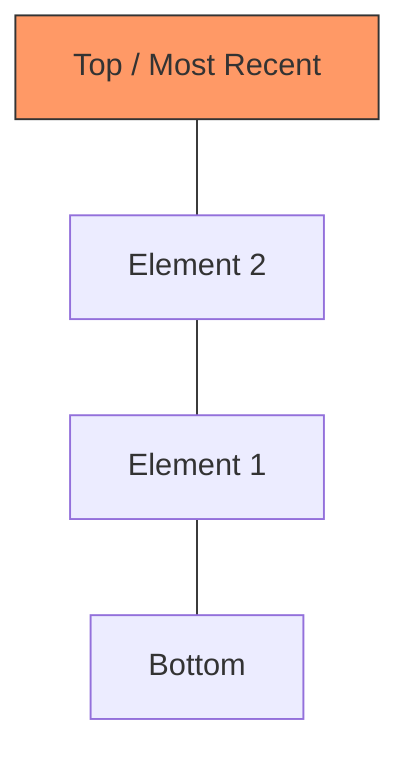

# Stack Concepts and Patterns

> "A Stack is a linear data structure that follows the **LIFO (Last-In-First-Out)** principle. The last element added to the stack will be the first one to be removed."

---

## Core Structure

### Stack Visualization

### Key Operations Complexity
| Operation | Time Complexity | Notes |
| :--- | :--- | :--- |
| **Push** | $O(1)$ | Add element to the top. |
| **Pop** | $O(1)$ | Remove element from the top. |
| **Peek/Top** | $O(1)$ | View the top element. |
| **isEmpty** | $O(1)$ | Check if stack contains elements. |

---

## Problem Set and Progress

| Problem | Difficulty | Key Pattern | Solutions |
| :--- | :--- | :--- | :--- |
| **LC #020: Valid Parentheses** | Easy | LIFO Balancing | [C++](LC_020_Valid_Parentheses.cpp), [Java](LC_020_Valid_Parentheses.java), [Python](LC_020_Valid_Parentheses.py) |
| **LC #155: Min Stack** | Medium | State Persistence | [C++](LC_155_Min_Stack.cpp), [Java](LC_155_Min_Stack.java), [Python](LC_155_Min_Stack.py) |
| **LC #150: Evaluate RPN** | Medium | Postfix Evaluation | [C++](LC_150_Evaluate_Reverse_Polish_Notation.cpp), [Java](LC_150_Evaluate_Reverse_Polish_Notation.java), [Python](LC_150_Evaluate_Reverse_Polish_Notation.py) |
| **LC #739: Daily Temperatures** | Medium | Monotonic Stack | [C++](LC_739_Daily_Temperatures.cpp), [Java](LC_739_Daily_Temperatures.java), [Python](LC_739_Daily_Temperatures.py) |

---

## Essential Patterns

### 1. Balancing Symbols
The most common application. Use a stack to store opening brackets and pop them when a matching closing bracket is encountered. If the stack is empty or the top doesn't match, the sequence is invalid.

### 2. Monotonic Stack
A stack that maintains elements in a specific order (increasing or decreasing). Used for "Next Greater Element" problems.

### 3. Min Stack / Max Stack
Using an auxiliary stack or custom objects to track the minimum/maximum value in $O(1)$ time alongside standard stack operations.

---

> *"The power of a stack lies in its ability to remember the order of operations and reverse them when needed."*
