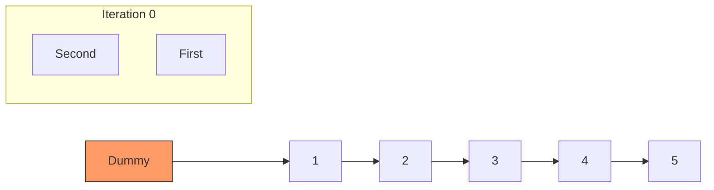

# LC #019: Remove Nth Node From End (Python Logic)

> **Pattern Card**: Two-Pointer (Gap) Technique + Dummy Node
> **Goal**: Position a pointer precisely relative to the tail using synchronized movement.

---

## 🎤 The Interview Pitch
"In Python, I implement the 'Remove Nth Node' problem using the two-pointer gap strategy to achieve a single-pass $O(N)$ solution. By decoupling the pointers with an $N$-node gap, we can traverse the list once and automatically land our trailing pointer at the exact position required to skip the target node. Python's dynamic object model makes initializing our dummy node and pointers exceptionally clean, reducing the risk of off-by-one errors typically found in multi-pass solutions."

---

## 🔍 Language-Specific Implementation (Comparative Analysis)

| Feature | C++ | Java | Python |
| :--- | :--- | :--- | :--- |
| **Dummy Node** | Stack-allocated | Heap-allocated | **Dynamic Object Creation** |
| **Logic Flow** | Explicit Pointer Arithmetic | Reference Assignments | **High-Readability References** |
| **Memory** | Manual `delete` | Garbage Collected | **Garbage Collected** |

### Why Python is "Better" for this Problem?
For this specific pattern, Python’s readability is a major advantage during technical interviews. The logic of `for _ in range(n + 1)` and `while first` is very expressive, allowing the interviewer to follow the pointer gap creation without getting bogged down in type declarations or manual memory management seen in C++.

---

## 🎨 Logic Visualization (The Gap)
Assume `List [1, 2, 3, 4, 5]` and `n = 2`.

1.  **Advance `First`**: Move `first` 3 steps forward (to `node 3`).
2.  **Slide Window**: Move `first` and `second` until `first` is `None`.
    - `second` will stop at `node 3`.
3.  **Removal**: `3.next = 5` (Destroys connection to `4`).

---

## 📐 Complexity Breakdown
- **Time Complexity**: $O(N)$
- **Space Complexity**: $O(1)$

---
[View Python Code](../../01_Data_Structures/Linked_List/LC_019_Remove_Nth_Node_From_End.py)
