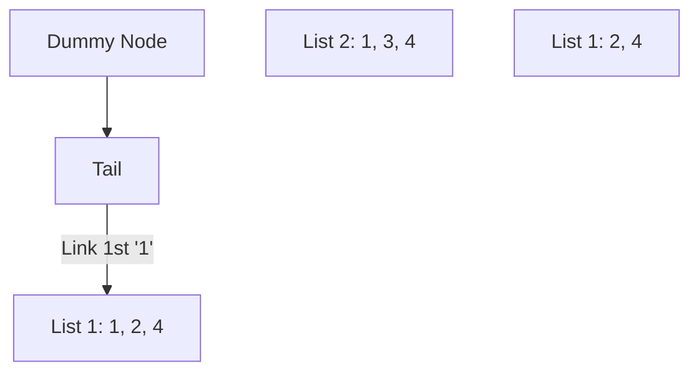

# LC #021: Merge Two Sorted Lists (Python Logic)

> **Pattern Card**: Dummy Node Technique
> **Goal**: Efficiently unify two streams of sorted data using dynamic pointers.

---

## 🎤 The Interview Pitch
"To merge two sorted lists in Python, I implement an iterative strategy using a **Dummy Node**. By initializing a placeholder node, I can seamlessly attach the head of the merged list without needing complex initial state checks. This algorithm simply traverses both lists simultaneously, re-pointing the 'next' attribute of our current tail to the smaller of the two nodes. This results in an $O(M+N)$ pass with zero extra space, leveraging Python's flexible memory model."

---

## 🔍 Language-Specific Implementation (Comparative Analysis)

| Feature | C++ | Java | Python |
| :--- | :--- | :--- | :--- |
| **Dummy Approach** | Stack-allocated `ListNode` | Heap-allocated `new ListNode` | **Winner for Conciseness** |
| **Pointer Wiring** | Explicit pointer arithmetic | Object reference update | Dynamic attribute update |
| **Edge Cases** | Ternary `? :` cleanup | Ternary `? :` cleanup | Pythonic `a or b` |

### Why Python is "Better" for this Problem?
1.  **Readability**: The comparison and re-wiring logic looks almost like pseudocode in Python.
2.  **Flexible Cleanup**: The logic to attach the remaining list is extremely compact: `tail.next = list1 or list2`. This is more idiomatic than the ternary operators in C++ or Java.
3.  **No Boilerplate**: No need for explicit type declarations inside the method, keeping the focus entirely on the algorithmic flow.

---

## 🎨 Logic Visualization (Iteration 1)
Assume `List1: [1, 2, 4]` and `List2: [1, 3, 4]`.

**Step**: Compare `1` and `1`. Attach `List1` node. Move `List1` and `Tail` pointers forward.

---

## 📐 Complexity Breakdown
- **Time Complexity**: $O(M + N)$
- **Space Complexity**: $O(1)$

---
[View Python Code](../../01_Data_Structures/Linked_List/LC_021_Merge_Two_Sorted_Lists.py)
