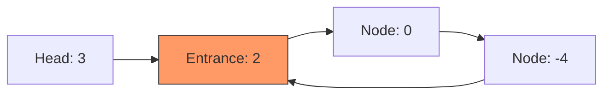

# LC #142: Linked List Cycle II (Python Logic)

> **Pattern Card**: Floyd's Cycle Detection (Phase 1 & 2)
> **Goal**: Detect cycle and pinpoint the entrance using synchronized pointer movement.

---

## 🎤 The Interview Pitch
"In Python, solving the 'Cycle II' problem without using a hash map ($O(1)$ space) is best achieved through Floyd’s detection engine. Phase 1 confirms the cycle exists by detecting a pointer collision. Phase 2 then exploits the mathematical relationship between the head and the entrance point. Python's dynamic object references allow us to implement this logic with zero boilerplate, ensuring the code remains as readable as it is efficient."

---

## 🔍 Language-Specific Implementation (Comparative Analysis)

| Feature | C++ | Java | Python |
| :--- | :--- | :--- | :--- |
| **Pointers** | Explicit `ListNode*` | Object References | Object References |
| **Logic** | Manual Pointers | Strong Reference Types | **Implicit Type Handling** |
| **Cleanliness** | Verbose | Mid-tier | **Winner (Minimalist)** |

### Why Python is "Better" for this Problem?
For cycle detection, the logic is purely sequential and pointer-based. Python's lack of explicit type declarations and curly braces allows the **Two-Phase Logic** to be perfectly readable, which is critical during the "explanation phase" of an interview. The condition `while entrance != slow` looks almost like a direct translation of the mathematical requirement.

---

## 🎨 Logic Visualization (Phase 2)
Imagine a list with a cycle of size 3, where entrance is at node 1.

- When Phase 1 ends, `slow` is at some node in the cycle.
- Resetting `entrance` to `head` and moving both at speed 1.
- **Collision at `2`!** This is the entrance.

---

## 📐 Complexity Breakdown
- **Time Complexity**: $O(N)$
- **Space Complexity**: $O(1)$

---
[View Python Code](../../01_Data_Structures/Linked_List/LC_142_Linked_List_Cycle_II.py)
