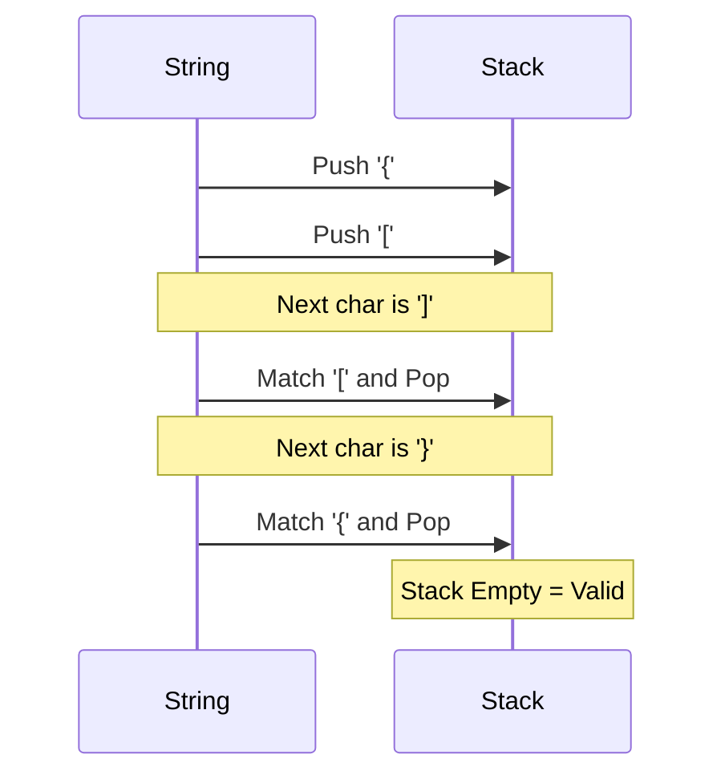

# LC #020: Valid Parentheses (C++ Logic)

> **Pattern Card**: LIFO Balancing
> **Goal**: Ensure every opening bracket in a sequence has a corresponding and correctly ordered closing bracket.

---

## 🎤 The Interview Pitch
"To determine if a string of parentheses is valid, a Stack is the ideal data structure due to its LIFO (Last-In-First-Out) property. As we scan the string, opening brackets represent pending completions. By pushing them onto the stack and popping them only when a matching closing bracket is found, we ensure that the most recently opened bracket is always the first one to be closed. This guarantees correct nesting."

---

## 🔍 Language-Specific Implementation (Comparative Analysis)

| Feature | C++ | Java | Python |
| :--- | :--- | :--- | :--- |
| **Stack DS** | `std::stack<char>` | `Stack<Character>` | **List `[]`** |
| **Mapping** | `std::unordered_map` | `HashMap<Char, Char>`| **Dictionary `{}`** |
| **Performance** | Optimized STL | Strong Typing | **Fastest Prototyping** |

### Why C++ for this Problem?
C++'s `std::stack` is part of the STL and provides a very clean interface for push/pop operations. Combined with `std::unordered_map` for constant-time lookups of matching pairs, the solution is both readable and high-performance.

---

## 🎨 Logic Visualization (Mermaid)
Scan: `"{ [ ] }"`

---

## 📐 Complexity Breakdown
- **Time Complexity**: $O(N)$ — We traverse the string exactly once.
- **Space Complexity**: $O(N)$ — In the worst case (all opening brackets), the stack stores the entire string.

---
[View C++ Code](../../01_Data_Structures/Stack/LC_020_Valid_Parentheses.cpp)
