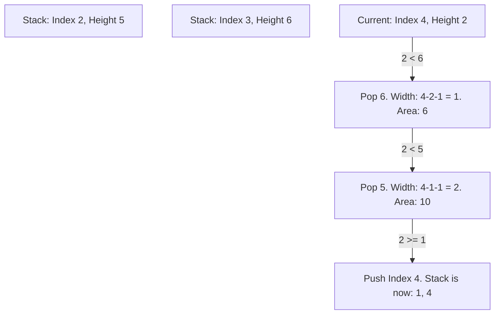

# LC #084: Largest Rectangle in Histogram (C++ Logic)

> **Pattern Card**: Monotonic Stack (Strictly Increasing)
> **Goal**: Maintain the left and right boundaries of potential rectangles in a single $O(N)$ pass.

---

## 🎤 The Interview Pitch
"To find the largest rectangle in a histogram, the brute force approach is to check every possible pair of bars, resulting in an $O(N^2)$ time complexity. By using a **Monotonic Increasing Stack**, we can optimize this to $O(N)$. We maintain a stack of indices representing bars in increasing order of height. When we encounter a bar that is lower than the one at the top of the stack, we know we have found the 'right boundary' for that top bar. We pop the stack, calculate the area using the popped height and the width between the current index and the new top of the stack (the 'left boundary'). This dynamically processes local maximums as we iterate. To ensure all remaining bars in the stack are processed at the end, we iterate up to `N` inclusive, treating index `N` as a phantom bar of height 0."

---

## 🔍 Language-Specific Implementation (Comparative Analysis)

| Feature | C++ | Java | Python |
| :--- | :--- | :--- | :--- |
| **Logic** | `std::stack` | `java.util.Stack` | **List `[]`** |
| **Flushing** | `i <= n` loop | `i <= n` loop | **Append 0 to array** |
| **Efficiency** | **Native Pointers**| Object Overhead | Best Array Slicing |

### Why C++ for this Design?
In C++, treating the loop limit as `i <= n` and using a ternary operator `(i == n) ? 0 : heights[i]` completely avoids allocating extra memory or modifying the input vector. It is highly efficient and keeps the `vector` structurally constant.

---

## 🎨 Logic Visualization (Mermaid)
Histogram: `[2, 1, 5, 6, 2, 3]`
A key moment occurs at index 4 (height = 2):

---

## 📐 Complexity Breakdown
- **Time Complexity**: $O(N)$ — Every index is pushed to the stack exactly once and popped exactly once.
- **Space Complexity**: $O(N)$ — In the worst-case scenario (a strictly increasing histogram), the stack stores all $N$ indices.

---
[View C++ Code](../../01_Data_Structures/Stack/LC_084_Largest_Rectangle_in_Histogram.cpp)
