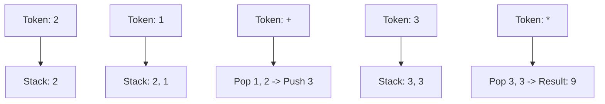

# LC #150: Evaluate Reverse Polish Notation (C++ Logic)

> **Pattern Card**: Postfix Evaluation (LIFO)
> **Goal**: Evaluate arithmetic expressions where operators follow their operands.

---

## 🎤 The Interview Pitch
"Reverse Polish Notation (RPN) is a postfix notation that eliminates the need for parentheses and complex operator precedence rules. To evaluate it, we use a Stack to track operands. As we scan the tokens, every number is pushed onto the stack. When an operator is encountered, we pop the top two values, apply the operation, and push the result back. This ensures that operations are performed in the exact sequence intended by the postfix structure, achieving a linear $O(N)$ time complexity."

---

## 🔍 Language-Specific Implementation (Comparative Analysis)

| Feature | C++ | Java | Python |
| :--- | :--- | :--- | :--- |
| **Logic** | `std::stack<int>` | `Stack<Integer>` | **List `[]`** |
| **Truncation**| Default (toward 0) | Default (toward 0) | **`int(a / b)`** |
| **Parser** | `stoi()` | `Integer.parseInt()`| **`int()`** |

### Why C++ for this Problem?
In C++, integer division `/` between two `int` types automatically truncates toward zero, which perfectly matches the LeetCode problem specification. In contrast, Python's `//` operator performs floor division (truncating toward negative infinity), requiring explicit `int(a / b)` logic for negative results.

---

## 🎨 Logic Visualization (Mermaid)
Expression: `["2", "1", "+", "3", "*"]`

---

## 📐 Complexity Breakdown
- **Time Complexity**: $O(N)$ — Each token is processed exactly once.
- **Space Complexity**: $O(N)$ — In the worst case (e.g., all operands followed by all operators), the stack stores half the tokens.

---
[View C++ Code](../../01_Data_Structures/Stack/LC_150_Evaluate_Reverse_Polish_Notation.cpp)
